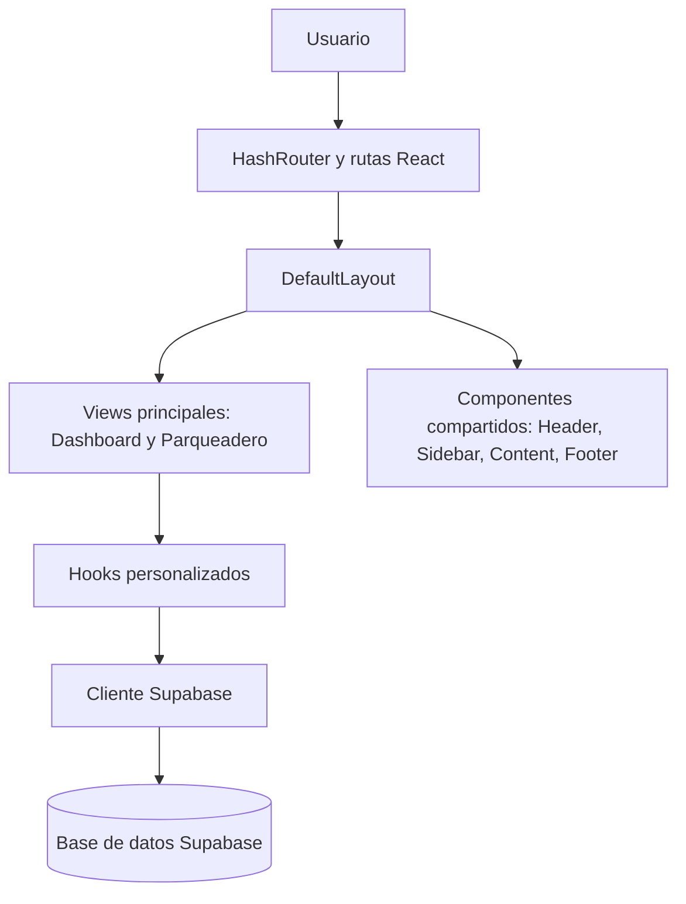
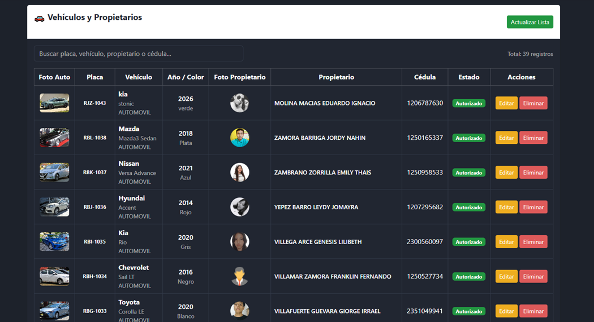
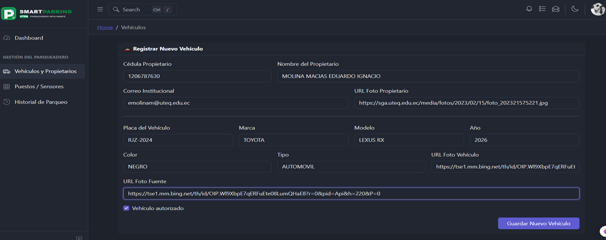
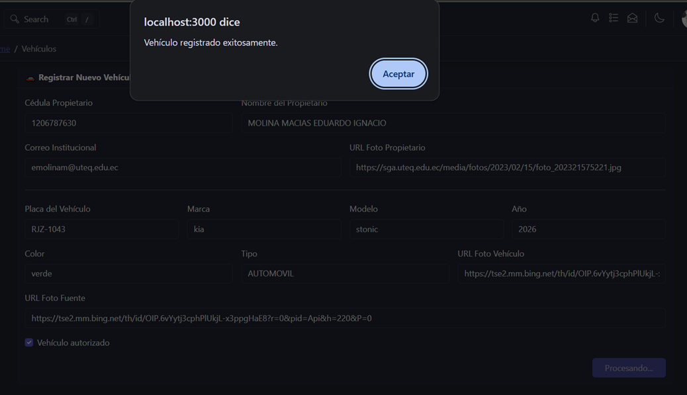
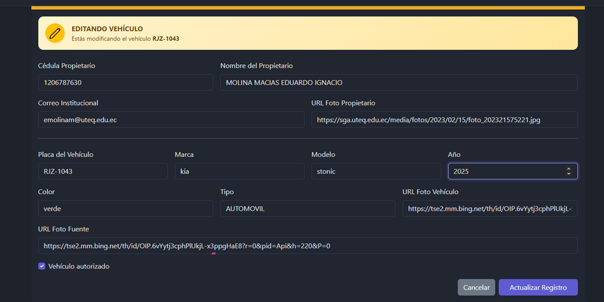
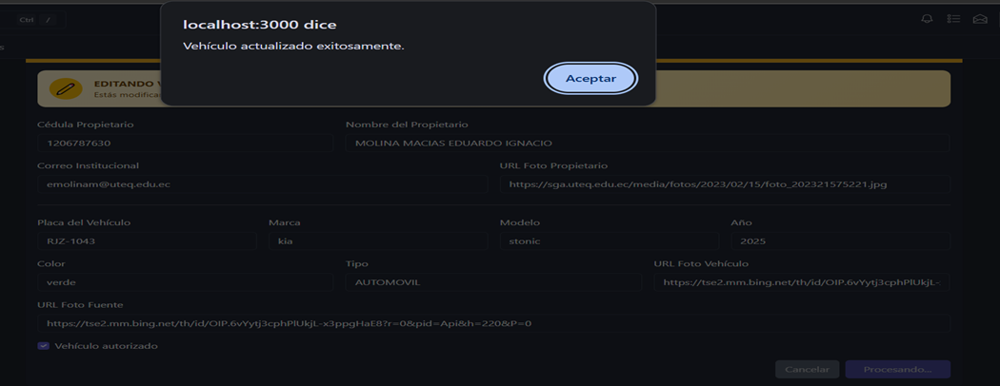
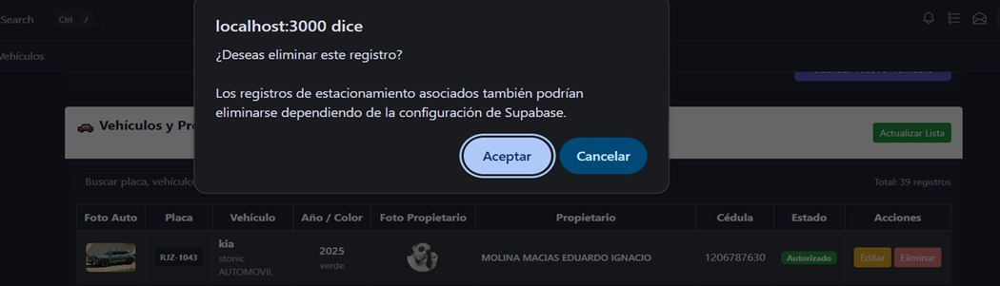
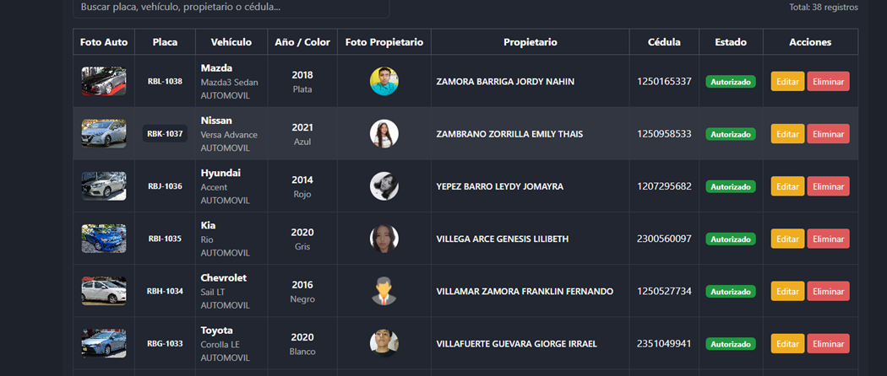

# UTEQ Smart Parking

Sistema web de gestion de parqueadero desarrollado para la Universidad Tecnica Estatal de Quevedo (UTEQ). La aplicacion centraliza el registro de vehiculos, la administracion de puestos de estacionamiento y la consulta del historial de accesos mediante una interfaz web construida con React y una base de datos gestionada con Supabase.

## Objetivo general

Desarrollar una herramienta web que facilite la administracion y el monitoreo de un parqueadero, proporcionando informacion organizada sobre vehiculos, puestos y registros de estacionamiento para apoyar el control operativo.

## Problema que resuelve

El sistema organiza en un solo lugar tareas que normalmente pueden gestionarse de forma manual o dispersa: registrar vehiculos y propietarios, conocer el estado de los puestos, asociar sensores a espacios y consultar los movimientos de entrada y salida.

## Usuarios destinatarios

Esta aplicacion esta dirigida a administradores y operadores responsables del control de un parqueadero. Por su contexto academico, tambien sirve como proyecto de aprendizaje y demostracion para estudiantes de Ingenieria en Telematica.

## Funcionalidades principales

- Inicio de sesion, registro, recuperacion y cambio de contrasena.
- Panel con el total de vehiculos, puestos, espacios ocupados y espacios disponibles.
- CRUD de vehiculos y datos de propietarios.
- Busqueda y paginacion en la gestion de vehiculos.
- CRUD de puestos de estacionamiento.
- Configuracion de columna, numero, codigo y sensor asociado a cada puesto.
- Visualizacion del estado y distancia registrada de los puestos.
- CRUD del historial de registros de estacionamiento.
- Asociacion de cada registro con un vehiculo y un puesto.
- Manejo de estados de carga y errores en las operaciones de datos.
- Navegacion responsive con barra lateral, encabezado y selector de tema.

## Tecnologias utilizadas

Las siguientes tecnologias y dependencias aparecen en el codigo o en `package.json`:

| Tecnologia | Uso en el proyecto |
| --- | --- |
| React 19 | Construccion de la interfaz mediante componentes y hooks |
| JavaScript (JSX) | Lenguaje de la aplicacion y sintaxis de componentes React |
| Vite | Servidor de desarrollo y compilacion de produccion |
| React Router DOM | Enrutamiento del sitio mediante `HashRouter` |
| CoreUI React | Componentes de interfaz, layout, formularios y widgets |
| CoreUI / Bootstrap 5 | Estilos y sistema visual responsive |
| Supabase | Cliente de autenticacion y acceso a la base de datos |
| Sass/SCSS | Estilos globales y personalizaciones |
| Chart.js | Graficos disponibles en el modulo de charts |
| Redux y React-Redux | Estado global de interfaz, tema y sidebar |
| ESLint y Prettier | Revision y formato del codigo |

HTML5 y CSS forman parte de la estructura y presentacion de la aplicacion a traves de `index.html` y los estilos SCSS compilados por Vite.

## Estructura real del proyecto

```text
Uteq_Smart_Parking_Uteq/
├── public/                  Archivos publicos
├── src/                     Codigo fuente de la aplicacion
│   ├── assets/              Logos, iconos e imagenes
│   ├── components/          Componentes reutilizables
│   ├── hooks/               Logica de acceso a datos
│   ├── layout/              Layout principal
│   ├── lib/                 Configuracion de Supabase
│   ├── scss/                Estilos globales
│   ├── views/               Vistas principales del sistema
│   │   ├── dashboard/       Panel principal
│   │   │   └── Dashboard.jsx
│   │   └── parqueadero/     Modulos del parqueadero
│   │       ├── Vehiculos.jsx
│   │       ├── Puestos.jsx
│   │       └── HistorialAcceso.jsx
│   ├── App.jsx              Componente raiz y enrutamiento
│   ├── index.jsx            Punto de entrada
│   ├── routes.js            Rutas internas
│   └── store.js             Estado global de interfaz
├── index.html               Plantilla HTML principal
├── package.json             Dependencias y scripts
├── vite.config.mjs          Configuracion de Vite
├── ARCHITECTURE.md          Documentacion de arquitectura
├── DEVELOPMENT.md           Guia de desarrollo
└── LICENSE                  Licencia del proyecto
```

### `src/assets/`

Contiene la identidad visual y recursos estaticos. `assets/brand/` incluye componentes como `logo.jsx`, `sygnet.jsx` y logotipos de marcas; `assets/icons/` contiene iconos propios; y `assets/images/` incluye imagenes existentes como `react.jpg` y avatares. Actualmente no existe una carpeta `screenshots/` ni capturas especificas de los modulos del sistema.

### `src/components/`

Incluye la estructura reutilizable de la aplicacion: `AppSidebar` y `AppSidebarNav` para la navegacion lateral, `AppHeader` y sus componentes internos para el encabezado, `AppBreadcrumb` para la ruta visual, `AppContent` para renderizar las rutas, y `AppFooter` para el pie de pagina. `DocsComponents`, `DocsExample`, `DocsIcons` y `DocsLink` pertenecen a las demostraciones de componentes incluidas en la plantilla CoreUI.

### `src/layout/`

El repositorio tiene `layout/` en singular, no `layouts/`. `DefaultLayout.jsx` compone el sidebar, header, contenido y footer, y sirve como contenedor visual de las rutas internas.

### `src/views/`

- `dashboard/`: `Dashboard.jsx`, que consulta y muestra el resumen del parqueadero.
- `parqueadero/`: modulos funcionales descritos abajo.

#### `src/views/parqueadero/`

| Archivo | Funcion |
| --- | --- |
| `Vehiculos.jsx` | Lista, busca, pagina y administra vehiculos. Incluye datos del propietario, cedula, correo, fotografias, tipo, marca, modelo, placa y autorizacion. |
| `Puestos.jsx` | Muestra y administra puestos; valida codigo, columna, numero, sensor y combinaciones duplicadas, y genera la ruta Firebase del puesto. |
| `HistorialAcceso.jsx` | Lista y administra registros de estacionamiento; relaciona vehiculos y puestos y gestiona fechas, sensor, distancia, estado y observaciones. |

### `src/hooks/`

Todos los hooks usan `useState`, `useCallback` y el cliente compartido de Supabase. Exponen `loading` y `error` para que las vistas informen el estado de cada operacion.

| Hook | Tabla | Operaciones |
| --- | --- | --- |
| `useVehiculos.js` | `vehiculos` | `fetchVehiculos`, `addVehiculo`, `updateVehiculo`, `deleteVehiculo` |
| `usePuestos.js` | `puestos` | `fetchPuestos`, `insertPuesto`, `updatePuesto`, `deletePuesto` |
| `useHistorial.js` | `registros_estacionamiento` | `fetchHistorial`, `insertHistorial`, `updateHistorial`, `deleteHistorial` |

Las consultas devuelven los datos ordenados, y las operaciones de escritura retornan objetos con `success`, `data` o `error`. Los errores se guardan en el estado del hook y la carga se finaliza en bloques `finally`.

### `src/lib/`

`supabase.js` lee `VITE_SUPABASE_URL` y `VITE_SUPABASE_PUBLISHABLE_KEY` desde `import.meta.env`, valida que existan y crea el cliente con `createClient`. El archivo no contiene credenciales reales.

## Arquitectura del sistema



El flujo de datos es el siguiente:

1. El usuario accede a una ruta desde la navegacion.
2. `App.jsx` configura `HashRouter` y carga las vistas de forma diferida con `React.lazy` y `Suspense`.
3. `DefaultLayout` presenta la estructura comun de la aplicacion.
4. Una vista usa el hook correspondiente para consultar o modificar datos.
5. El hook llama a Supabase, actualiza `loading` y `error`, y devuelve el resultado a la vista.

Por ejemplo, `Vehiculos.jsx` obtiene desde `useVehiculos.js` las funciones `fetchVehiculos`, `addVehiculo`, `updateVehiculo` y `deleteVehiculo`. El hook ejecuta las operaciones sobre la tabla `vehiculos`, mientras la vista administra el formulario, la busqueda, la paginacion y la presentacion de resultados.

## Modulos del sistema

| Modulo | Funcion | Relacion con la base de datos |
| --- | --- | --- |
| Autenticacion | Login, registro, confirmacion de correo, recuperacion y cambio de contrasena | Usa el flujo de autenticacion de Supabase desde las vistas de `authentication`; no se expone ninguna credencial en el repositorio |
| Dashboard | Resume vehiculos registrados y estado de puestos ocupados/disponibles | Consulta `vehiculos` y `puestos` directamente |
| Vehiculos y propietarios | Gestiona registros vehiculares y los datos asociados del propietario | CRUD sobre `vehiculos` |
| Puestos y sensores | Administra espacios, su ubicacion, sensor, estado y distancia | CRUD sobre `puestos` |
| Historial de accesos | Registra y consulta entradas, salidas y datos asociados | CRUD sobre `registros_estacionamiento`; consulta tambien `vehiculos` y `puestos` para seleccionar relaciones |

El repositorio tambien contiene vistas de demostracion de componentes, formularios, iconos, graficos y widgets heredadas de la plantilla CoreUI. Estas se mantienen como parte de la estructura existente, pero los modulos funcionales del parqueadero son los indicados en la tabla anterior.

## Operaciones CRUD

| Operacion | Accion | Implementacion |
| --- | --- | --- |
| Create | Registrar un vehiculo, puesto o registro de acceso | `addVehiculo`, `insertPuesto`, `insertHistorial` |
| Read | Consultar y listar informacion | `fetchVehiculos`, `fetchPuestos`, `fetchHistorial`; el dashboard tambien consulta Supabase directamente |
| Update | Editar un registro existente mediante su `id` | `updateVehiculo`, `updatePuesto`, `updateHistorial` |
| Delete | Eliminar un registro mediante su `id` | `deleteVehiculo`, `deletePuesto`, `deleteHistorial` |

Las vistas `Vehiculos.jsx`, `Puestos.jsx` e `HistorialAcceso.jsx` conectan estos metodos a formularios y acciones de usuario. Antes de enviar datos realizan validaciones propias del modulo; el historial, por ejemplo, valida el vehiculo y el codigo del registro, y convierte los identificadores relacionados a numero.

## Supabase

Supabase cumple dos funciones en el proyecto:

- Proporciona el cliente de autenticacion para los flujos de acceso.
- Proporciona la API de datos utilizada por los hooks y el dashboard.

### Tablas identificadas en el codigo

- `vehiculos`: vehiculos y datos de propietarios.
- `puestos`: codigo, columna, numero, sensor, ruta, estado y distancia del puesto.
- `registros_estacionamiento`: relaciones con vehiculo y puesto, fechas, codigo, sensor, distancia, estado y observacion.

Las consultas siguen el patron de Supabase `.from('tabla').select(...)`, mientras que las escrituras usan `.insert(...)`, `.update(...).eq('id', id)` y `.delete().eq('id', id)`. Los errores de Supabase se lanzan para ser capturados por cada hook; posteriormente se exponen mediante `error` y las listas fallidas devuelven un arreglo vacio.

Configura las politicas de Row Level Security en Supabase de acuerdo con los usuarios y operaciones permitidas en tu entorno. El repositorio no incluye el esquema SQL ni politicas de base de datos, por lo que deben verificarse en el proyecto de Supabase utilizado.

## Instalacion y configuracion

### Requisitos

- Node.js 18 o superior recomendado.
- npm.
- Un proyecto de Supabase configurado con las tablas requeridas.

### Pasos

1. Clona el repositorio:

   ```bash
   git clone URL_DEL_REPOSITORIO
   cd Uteq_Smart_Parking_Uteq
   ```

2. Instala las dependencias:

   ```bash
   npm install
   ```

3. Crea `.env.local` en la raiz del proyecto con las variables necesarias.

4. Inicia el servidor de desarrollo:

   ```bash
   npm start
   ```

   El script real definido en `package.json` es `start` y ejecuta Vite. En Windows tambien puedes usar `npm.cmd start`.

5. Genera la compilacion de produccion cuando sea necesario:

   ```bash
   npm run build
   ```

   Los archivos se generan en `dist/`. Para previsualizarlos localmente utiliza `npm run serve`.

> Este repositorio no define un script `dev`; por eso el comando correcto para desarrollo es `npm start`.

## Variables de entorno

El cliente de Supabase exige estas variables:

```env
VITE_SUPABASE_URL=tu_url_de_supabase
VITE_SUPABASE_PUBLISHABLE_KEY=tu_clave_publicable_de_supabase
```

El nombre utilizado por el codigo es `VITE_SUPABASE_PUBLISHABLE_KEY`, no `VITE_SUPABASE_ANON_KEY`. No subas `.env`, `.env.local` ni credenciales reales a GitHub. Nunca incluyas contrasenas, tokens, service role keys o claves privadas en el README o en el codigo fuente.

## 📸 Capturas de pantalla

### Gestión de vehículos y propietarios

#### Lista de vehículos



Vista general de todos los vehículos registrados con búsqueda, paginación, datos del propietario, fotografías y acciones disponibles.

#### Crear nuevo vehículo



Formulario para registrar un nuevo vehículo con datos del propietario, cédula, correo, placa, marca, modelo, año, color, tipo y fotografías.

#### Confirmación de registro



Mensaje de confirmación al registrar exitosamente un nuevo vehículo en el sistema.

#### Editar vehículo



Formulario para editar los datos de un vehículo existente, mostrando la información actual y permitiendo actualizar cualquier campo.

#### Confirmación de actualización



Mensaje de confirmación al actualizar exitosamente los datos de un vehículo.

#### Confirmación de eliminación



Mensaje de confirmación antes de eliminar un registro.

#### Lista después de la eliminación



Listado actualizado después de eliminar el registro.

## Comandos disponibles

| Comando | Descripcion |
| --- | --- |
| `npm start` | Inicia Vite en desarrollo |
| `npm run build` | Genera la compilacion de produccion |
| `npm run serve` | Previsualiza la compilacion |
| `npm run lint` | Ejecuta ESLint |

## Actualizar el repositorio en GitHub

```bash
git add .
git commit -m "Actualización del proyecto"
git push
```

Revisa los cambios con `git status` antes de confirmar y asegúrate de no incluir archivos `.env` ni credenciales.

## Autor

Proyecto académico desarrollado para la carrera de Ingeniería en Telemática de la UTEQ.

El repositorio no especifica un nombre individual de autor. Actualiza esta sección con los nombres de los integrantes y el docente responsable antes de la entrega final.

## Documentacion adicional

- [ARCHITECTURE.md](ARCHITECTURE.md): arquitectura y organización técnica heredada del proyecto base.
- [DEVELOPMENT.md](DEVELOPMENT.md): guía de desarrollo y comandos disponibles.
- [LICENSE](LICENSE): licencia del proyecto.
